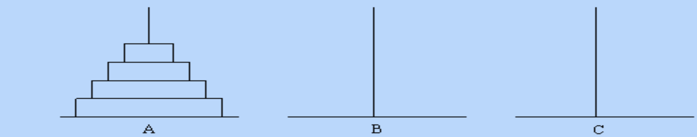

/**

 \* 递归的作用

 \* 1）替代多重循环

 \* 2）解决本来就是用递归形式定义的问题

 \* 3）将问题分解为规模更小的子问题进行求解

 *

*/

### 汉诺塔问题

/**

 \*  汉诺塔问题(Hanoi)

 \* 古代有一个梵塔，塔内有三个座A、B、C，A座上有64个盘子，盘子大小不等，

 \* 大的在下，小的在上。

 \* 有一个和尚想把这64个盘子从A座移到C座，但每次只能允许移动一个盘子，并且在移动过程中，

 \* 3个座上的盘子始终保持大盘在下，小盘在上。在移动过程中可以利用B座，要求输出移动的步骤。

*/




### N皇后问题

- n皇后问题:输入整数n, 要求n个国际象棋的皇后，摆在 n*n的棋盘上，互相不能攻击，输出全部方案。

输入一个正整数N，则程序输出N皇后问题的全部摆法。

输出结果里的每一行都代表一种摆法。行里的第i个数字如果是n，就代表第i行的皇后应该放在第n列。

皇后的行、列编号都是从1开始算。

样例输入:

4

样例输出:

2 4 1 3 

3 1 4 2


### 逆波兰表达式

- 用递归解决递归形式的问题

```

```

例题:逆波兰表达式

​        逆波兰表达式是一种把运算符前置的算术表达式(其实一般教科书上称这种表 达式为波兰表达式) ，例如普通的表达式2 + 3的逆波兰表示法为+ 2 3。逆波兰 表达式的优点是运算符之间不必有优先级关系，也不必用括号改变运算次序，例如 (2 + 3) * 4的逆波兰表示法为* + 2 3 4。本题求解逆波兰表达式的值，其中运算符 包括+ - * /四个。

- 输入

  输入为一行，其中运算符和运算数之间都用空格分隔，运算数是浮点 数

- 输出

输出为一行，表达式的值。

- 样例输入
  * + 11.0 12.0 + 24.0 35.0

- 样例输出
  - 1357.000000 提示:(11.0+12.0)*(24.0+35.0)


> 本题中“逆波兰表达式”的定义:
>
> \1) 一个数是一个逆波兰表达式，值为该数
>
> \2) "运算符 逆波兰表达式 逆波兰表达式" 是逆波兰表达 式 ，值为两个逆波兰表达式的值运算的结果

### 四则运算表达式求值

输入为四则运算表达式，仅由整数、+、-、*、/ 、(、) 组成，没有空格，要求求其值。假设运算符结果都是整数 。"/"结果也是整数

```c
/** 表达式求值

 \* 输入一个表达式，对表达式进行求值

 \* 分解：表达式分解为项和因子，表达式是由多个项进行加减得到，项是因子间乘除得到

 \* so 需要写一个求项的值的函数

 \*         一个求因子的值的函数

 \*         一个求表达式的值的函数

 \* 

 \* 

 \* */
void ExperessionVal();
int exp_val();
```


### 爬楼梯

- 用递归将问题分解为规模更小的子问题进行求解

树老师爬楼梯，他可以每次走1级或者2级，输入楼梯的级数， 求不同的走法数

- 输入

输入包含若干行，每行包含一个正整数N，代表楼梯级数，1 <= N <= 30输出不同的走法数，每一行输入对应一行

- 输出

不同的走法数，每一行输入对应一行输出

样例输入

5

8

10 

样例输出 

8

34

89

```c
/**
 n级台阶的走法 =
	先走一级后，n-1级台阶的走法 + 先走两级后，n-2级台阶的走法
	f(n) = f(n-1)+f(n-2)
	边界条件：n  < 0 f = 0; n = 0; f = 1;
*/
int Stairs(int n);
```


### 例题:放苹果

把M个同样的苹果放在N个同样的盘子里，允许有的盘子空着不放， 问共有多少种不同的分法?5，1，1和1，5，1 是同一种分法。
 输入
 第一行是测试数据的数目t(0 <= t <= 20)。以下每行均包含二个整 数M和N，以空格分开。1<=M，N<=10。

输出

对输入的每组数据M和N，用一行输出相应的K。

样例输入

1
73 

样例输出 8

